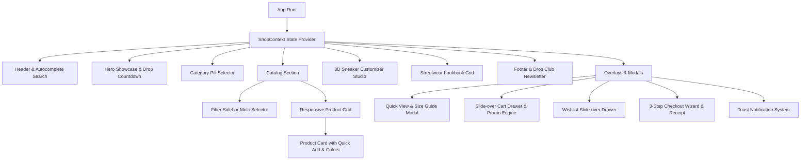

<div align="center">

# 👟 STRIDE — Next-Gen Footwear & Sneaker E-Commerce

<p align="center">
  <strong>An ultra-modern, high-performance shopping platform for athletic sneakers, luxury footwear, and bespoke streetwear.</strong>
</p>

[](https://reactjs.org/)
[](https://www.typescriptlang.org/)
[](https://vitejs.dev/)
[](https://tailwindcss.com/)
[]()
[-ff5e3a?style=for-the-badge)]()

<br/>


</div>

---

> [!IMPORTANT]
> ### 🚧 Project Status: Frontend MVP (In Active Development)
> **Please Note**: This repository currently contains the **complete client-side frontend web application**. It features fully interactive UI/UX components, dynamic product filtering, a real-time 3D Sneaker Customizer Studio, slide-over cart, wishlist, and simulated multi-step checkout.
>
> 🚀 **Full-Stack In Progress**: Our team is actively engineering the backend services (REST API / GraphQL, PostgreSQL database, Auth0/Firebase user management, production Stripe & PayPal checkout, and real-time inventory management). Check out our [Roadmap](#-development-roadmap-to-completion) below.

---

## 📸 Visual Showcase & Previews

<div align="center">

| 🔥 Flagship Drop Showcase | 🎨 3D Customizer Studio |
| :---: | :---: |
|  <br/> *AeroPulse HyperDrive Elite with ZoomX Nitro* |  <br/> *Interactive Bespoke Sneaker Color Studio* |

| 🏷️ Streetwear Lookbook | 👟 Retro Classics & Icons |
| :---: | :---: |
|  <br/> *Community On-Foot Styled Outfits & Tags* |  <br/> *Vintage Leather Overlays & Gum Cupsoles* |

</div>

---

## ✨ Key Features & Capabilities

### 1. 🔍 Instant Autocomplete Live Search
- Real-time search query matching across sneaker model names, brands, technologies, and categories.
- Floating dropdown preview with high-res thumbnails, prices, and direct Quick-View navigation.

### 2. ⚡ Flagship Hero & Live Drop Timer
- Dynamic interactive hero spotlighting limited-edition drops.
- Synchronized live countdown timer for flash releases.
- Instant "Quick Buy" and "3D Studio" fast-actions.

### 3. 🎛️ Multi-Faceted Faceted Catalog Filter
- **Multi-Brand Filter**: Nike, Adidas, Jordan, New Balance, Puma, Asics, Salomon.
- **Gender Categorization**: Men, Women, and Unisex.
- **Shoe Size Grid**: Instant US 6 through US 13 size selection.
- **Price Range Slider**: Dynamic dual-bound price filter ($50 – $300).
- **Colorway Palette Swatches**: Visual color circle filters.
- **Stock Status**: In-Stock availability toggling.
- **Sorting Engine**: Price (Low to High / High to Low), Highest Rated, Newest, and Featured.

### 4. 👟 Interactive Product Cards
- **Hover Crossfade**: Instant angle transition and smooth image zoom.
- **On-Card Color Swapper**: Click color swatches directly on the card to change shoe color and angles.
- **Quick-Size Popover**: Select your US size and add to cart in 1 click without leaving the catalog.
- **Wishlist Sync**: Persistent favoriting synced with browser `localStorage`.

### 5. 👁️ Quick View Modal & Size Calculator
- Multi-angle thumbnail image gallery reel.
- Integrated **Size Conversion Guide** popup (US, EU, CM).
- Verified customer reviews tab with an interactive **"Write a Review"** rating submission form.
- Real-time inventory counter (*"Only 4 left in stock"*).

### 6. 🎨 3D Interactive Sneaker Customizer Studio
- Real-time SVG sneaker canvas with interactive clickable zones:
  - Base Body Mesh
  - Leather Overlays
  - Lightning Swoosh Accent
  - Midsole & Cushion
  - Laces & Eyelets
  - Collar Lining
- **Personalized Heel Inscription**: Live laser text engraving onto the sneaker heel.
- **Curated Presets**: 1-click styles (*Cyberpunk Neon, Chicago Bred, Stealth Triple Black, Solar Horizon*).
- Directly adds your custom bespoke design into your cart!

### 7. 🛍️ Slide-Over Cart Drawer & Promo Code Engine
- Dynamic **Free Shipping Progress Meter** ($150 target).
- Integrated Coupon Engine supporting discount codes:
  - `STRIDE20` — 20% Off entire order
  - `KICKSTART15` — 15% Off welcome bonus
  - `FREESHIP` — Free Express Priority Shipping
  - `VIP50` — $50 Instant Voucher
- Quantity adjustments and item removals with live subtotal calculations.

### 8. 💳 Multi-Step Checkout Wizard
- **Step 1: Shipping Details** (Address, Contact info, Postal code).
- **Step 2: Delivery Speed** (Standard Tracked vs. Priority Courier).
- **Step 3: Secure Payment Simulation** (Credit Card, Apple Pay, Fast UPI).
- **Step 4: Order Confirmation** with unique Order ID, receipt summary, and celebratory **Canvas Confetti Blast**!

### 9. 📸 Streetwear Community Lookbook
- Instagram-style editorial grid featuring on-foot styling inspiration with shoppable hotspots linking directly to sneakers in the store.

---

## 🏗️ Architecture & Component Hierarchy



---

## 🛠️ Tech Stack & Libraries

| Technology | Purpose |
| :--- | :--- |
| **React 19 / 18** | High-performance reactive UI component architecture |
| **TypeScript** | Strict compile-time type safety with `verbatimModuleSyntax` |
| **Vite 6** | Next-generation ultra-fast frontend build tooling |
| **Tailwind CSS v4** | Modern utility-first styling with customized dark theme & glow effects |
| **Lucide React** | Feather-light modern icons |
| **Canvas Confetti** | Celebration visual particle physics on successful checkout |
| **HTML5 Canvas / SVG** | Vector rendering for interactive shoe customization |
| **LocalStorage API** | Seamless cart and wishlist state persistence across reloads |

---

## 🚀 Getting Started & Local Development

### Prerequisites
Make sure you have **Node.js** (v18.0.0 or higher) and **npm** installed on your system.

```bash
node -v
npm -v
```

### 1. Clone the Repository
```bash
git clone https://github.com/meetvartak24/STRIDE-Premium-Footwear-Sneaker.git
cd STRIDE-Premium-Footwear-Sneaker
```

### 2. Install Dependencies
```bash
npm install
```

### 3. Run Development Server
```bash
npm run dev
```
> The local development server will start at `http://localhost:5173`. Open it in your browser to test the live store!

### 4. Build for Production
```bash
npm run build
```
> Produces an optimized, minified production build in the `/dist` directory.

---

## 🗺️ Development Roadmap to Completion

- [x] **Phase 1: High-Performance Frontend & Design System**
  - [x] Modern dark obsidian UI with electric glow aesthetics.
  - [x] Responsive navigation, category selectors, and hero showcase.
  - [x] Dynamic multi-faceted filtering and live search autocomplete.
- [x] **Phase 2: Interactive Sneaker Studio & Cart Engine**
  - [x] Interactive SVG 3D Sneaker Customizer with real-time laser engraving.
  - [x] Slide-over Cart Drawer with free shipping progress & coupon engine.
  - [x] Multi-step simulated checkout with receipt generation & confetti.
  - [x] Persistent Wishlist and verified customer review submission.
- [ ] **Phase 3: Backend REST / GraphQL API (In Progress ⏳)**
  - [ ] Node.js / Express or Go backend microservices.
  - [ ] PostgreSQL / MongoDB database for product catalog, orders, and user data.
- [ ] **Phase 4: Authentication & User Accounts (Upcoming ⏳)**
  - [ ] JWT / OAuth2 / NextAuth / Firebase Auth (Google, Apple, Email sign-in).
  - [ ] User profile, saved addresses, and order tracking history.
- [ ] **Phase 5: Production Payment Gateways (Upcoming ⏳)**
  - [ ] Stripe API integration (Credit Cards, Apple Pay, Google Pay).
  - [ ] PayPal & Klarna Buy-Now-Pay-Later integrations.
- [ ] **Phase 6: Warehouse & Admin Dashboard (Upcoming ⏳)**
  - [ ] Real-time inventory tracking & automated stock updates.
  - [ ] Admin panel for managing product drops, promotions, and sales analytics.

---

## 🤝 Contributing

Contributions, issues, and feature requests are welcome! Feel free to check the [issues page](https://github.com/meetvartak24/STRIDE-Premium-Footwear-Sneaker/issues).

1. Fork the repository
2. Create your Feature Branch (`git checkout -b feature/AmazingFeature`)
3. Commit your Changes (`git commit -m 'Add some AmazingFeature'`)
4. Push to the Branch (`git push origin feature/AmazingFeature`)
5. Open a Pull Request

---

## 📄 License

This project is licensed under the **MIT License** — feel free to use it for personal and commercial projects.

<div align="center">
  <sub>Built with ❤️ by the STRIDE Footwear Development Team.</sub>
</div>
